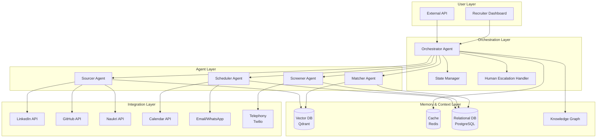
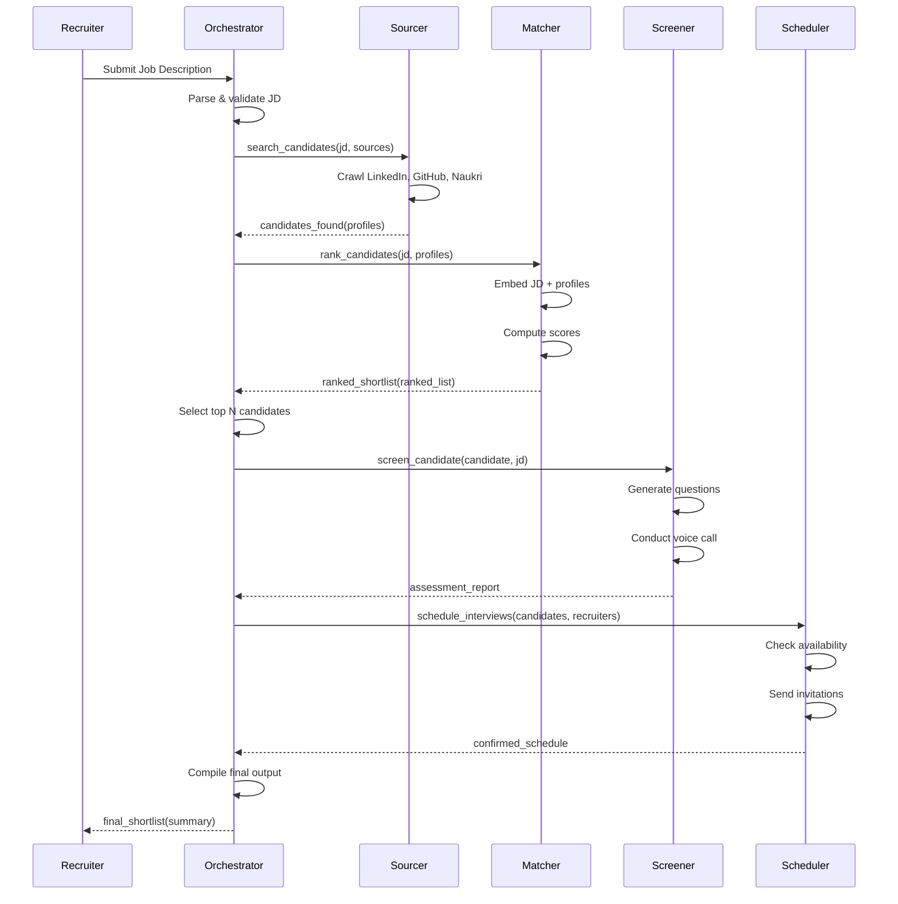
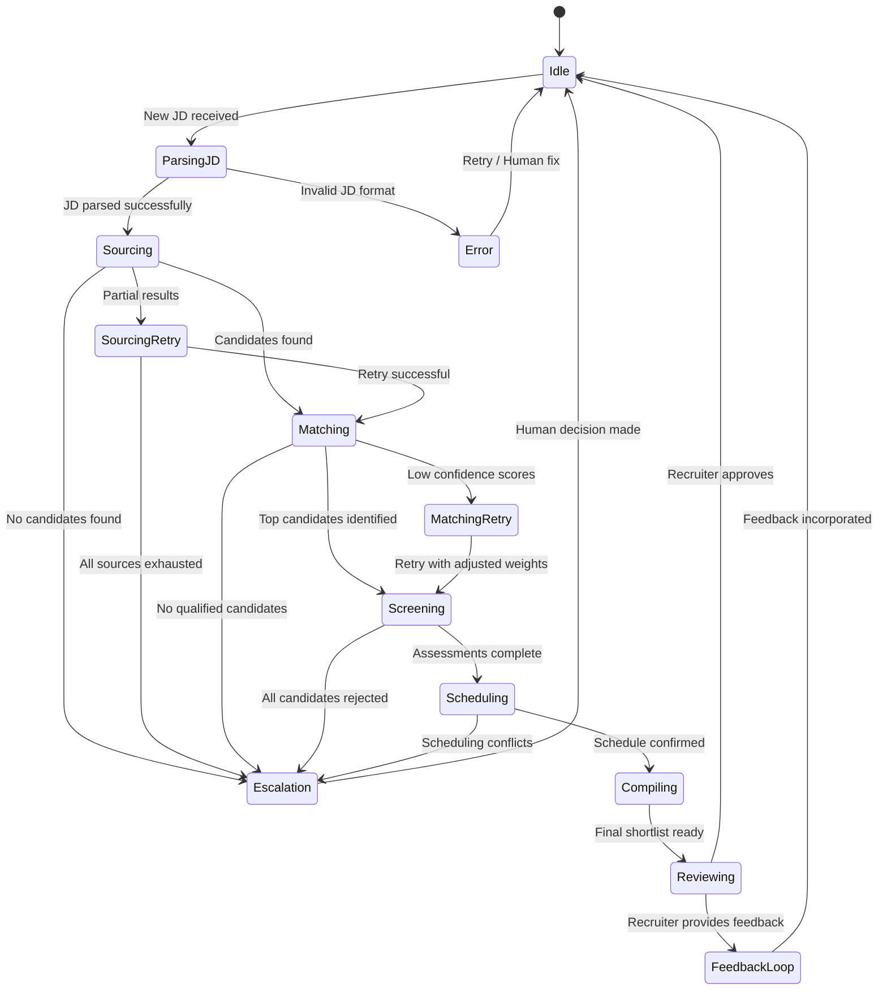
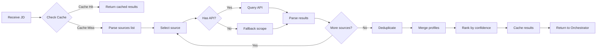
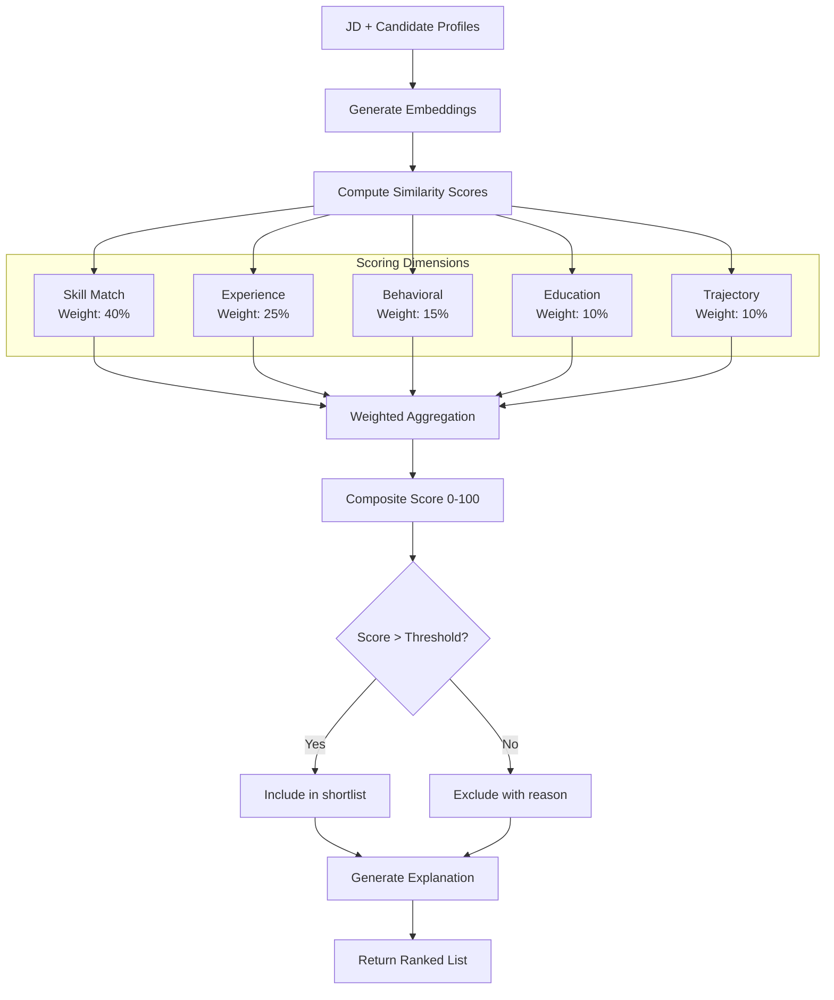
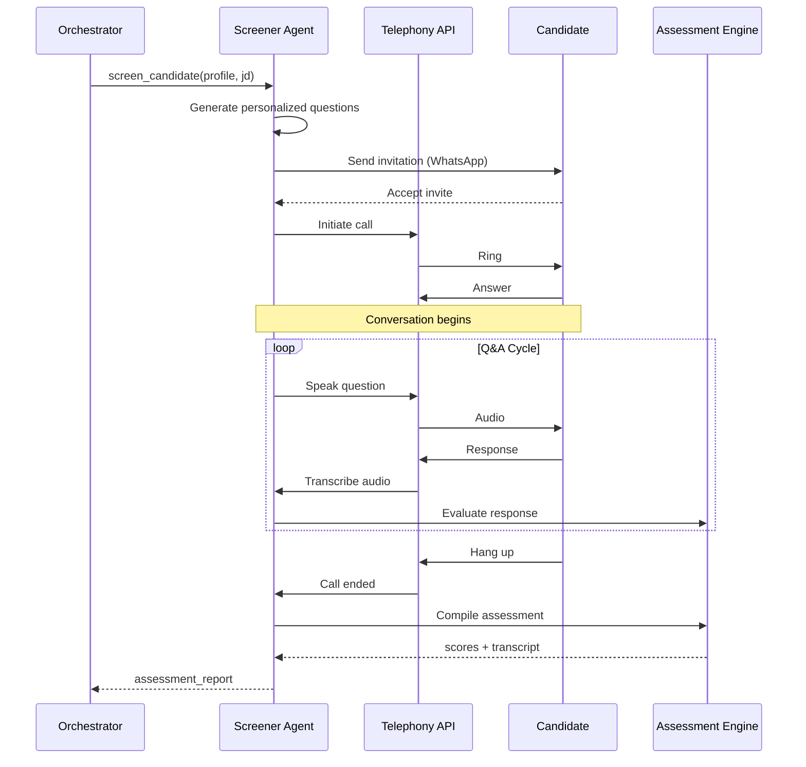
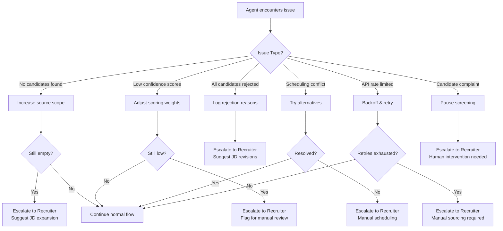

# Diagrams — AI Recruiter Agent Swarm

All diagrams are written in Mermaid format. Render them using any Mermaid-compatible viewer (GitHub renders these natively).

---

## 1. System Architecture Diagram

---

## 2. Agent Communication Sequence (Normal Flow)

---

## 3. Orchestrator State Machine

---

## 4. Sourcer Agent Flow

---

## 5. Matcher Agent Scoring Pipeline

---

## 6. Screener Agent Voice Pipeline

---

## 7. Human Escalation Decision Tree

